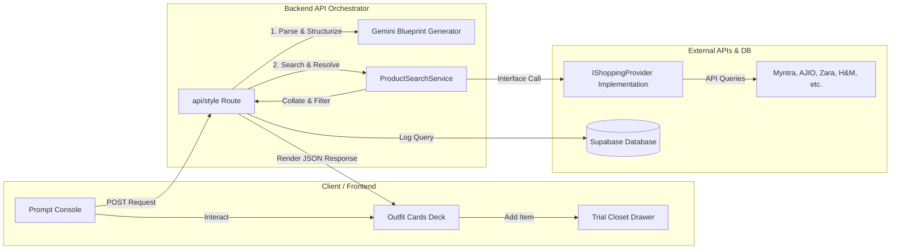
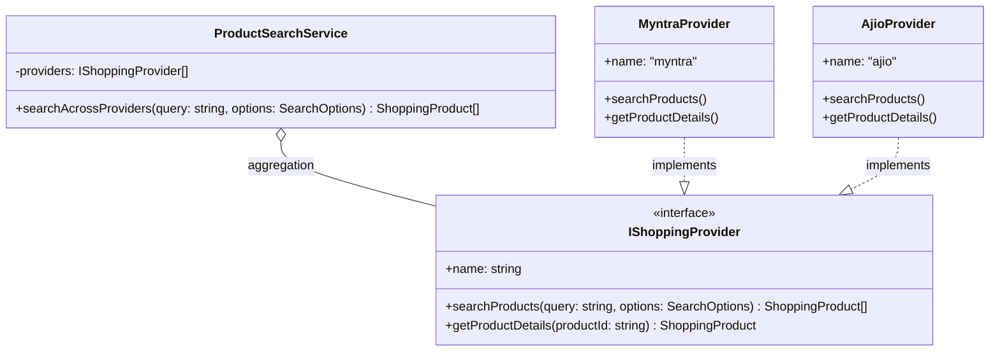

# Drip AI — Software Architecture & Design

This document details the architectural design and software engineering patterns driving **Drip AI**.

---

## 1. Architectural Overview

Drip AI utilizes a modular, decoupled full-stack React architecture using **Next.js (App Router)**. Business services are isolated from React views to prevent vendor lock-in and enable smooth horizontal scaling.

---

## 2. Decoupled Provider Architecture

One of Drip AI's core architectural constraints is that the application must **never** directly integrate a retail partner's API or a raw Google/Serper search query directly into the API routes or UI components. All product lookups are routed through a provider-neutral gateway.

### The Contracts & Interfaces

1. **`IShoppingProvider`**: The base contract mapping retail queries to a common response pattern.
2. **`ProductSearchService`**: An aggregator class containing references to active providers. It runs queries concurrently, collects results, handles failure cases gracefully (falling back to other active providers), and groups products to fit the outfit recommendation.

---

## 3. Styling Guidelines & Theme Setup

Drip AI uses **CSS Modules with Vanilla CSS** to avoid heavy utility class dependencies and to ensure maximum visual control over the premium design aesthetic.

### Aesthetic Principles (Apple / Linear / Notion Inspired)
- **Colors**: Sleek, high-contrast dark mode using solid dark backdrops (`#000000`, `#0A0A0A`), crisp gray borders (`#1F1F1F`, `#2A2A2A`), and electric neon accents.
- **Glassmorphism**: Backdrop blur combinations (`backdrop-filter: blur(12px)`) mixed with low-opacity border details to form premium, floating card structures.
- **Typography**: Inter/Geist font families with spacious letter-spacing and clean line heights.
- **Layouts**: Clear, generous margins and padding layout structures that allow contents to "breathe".
- **Micro-Animations**: Smooth transition timings on button states, drawer slides, and text inputs.

---

## 4. Scaling Roadmap

### Phase 2: User Persistence & History
- Integrate Supabase authentication (sign-up, sign-in, magic links).
- Save outfit history to Postgres database via direct Supabase Client queries.
- Persist Trial Closet configurations to a `saved_closets` table.

### Phase 3: AI Virtual Try-On & Visual Assets
- Introduce image upload capability (Supabase Storage).
- Connect the frontend canvas to a virtual try-on API (e.g., Fashn.ai, Stable Diffusion VTO).
- Run generative imaging pipelines to overlay clothing templates onto user model photos.

### Phase 4: Social Features & AI Outfit Rating
- Create community sharing modules where users publish their customized closets.
- Add an AI Outfit Rating feature utilizing multimodal LLM prompts (Gemini Vision) to critique user-uploaded outfit snapshots and suggest refinement tweaks.
