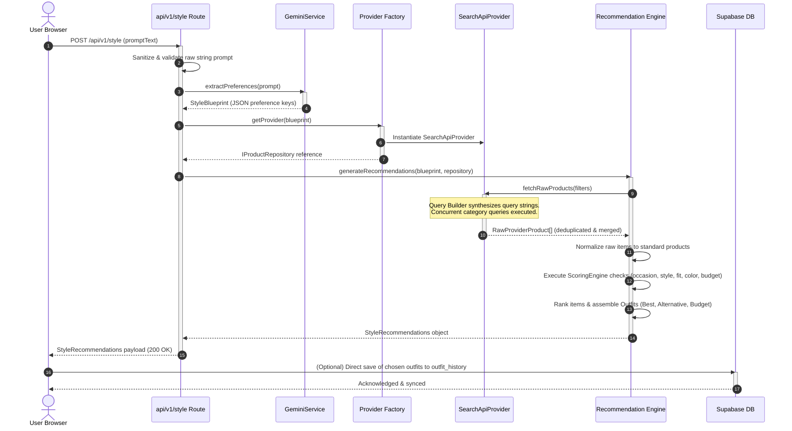

# Drip AI Request Processing API Flow

This document maps the lifecycle of a single fashion style request from the frontend console to the backend AI and search coordinates, back up to the client layout.

---

## 🗺️ Sequence Flow Diagram

---

## 🛠️ Step-by-Step Flow Explanation

1. **Prompt ingestion**: The user triggers `onSubmit(prompt, filters)` inside the [PromptSection](file:///Users/priyanshudutta/Desktop/DripAi/src/components/stylist/PromptSection.tsx). The dashboard displays a floating glassmorphic loader and dispatches a fetch call to POST `/api/v1/style`.
2. **Sanitization & Extraction**: The API route parses the body, sanitizes the query, and forwards it to the [GeminiService](file:///Users/priyanshudutta/Desktop/DripAi/src/services/gemini.ts). Gemini resolves structured user parameters (`occasion`, `fit`, `budget`, `gender`) using strict JSON schema enforcement.
3. **Repository Resolution**: The route imports the [ProductProviderFactory](file:///Users/priyanshudutta/Desktop/DripAi/src/services/intelligence/providers/ProductProviderFactory.ts) and fetches the configured provider.
4. **Recommendation coordination**: The route calls the [StyleIntelligenceEngine](file:///Users/priyanshudutta/Desktop/DripAi/src/services/intelligence/StyleIntelligenceEngine.ts), which triggers product fetching.
5. **Parallel fetching**: The provider compiles search queries using the [SearchQueryBuilder](file:///Users/priyanshudutta/Desktop/DripAi/src/services/intelligence/providers/SearchQueryBuilder.ts), queries adapters concurrently, caches outputs, consolidates alternate merchant offers, and yields standardized records.
6. **Scoring & Assembly**: The engine normalizes parameters, scores items across multi-dimensional criteria using the [ScoringEngine](file:///Users/priyanshudutta/Desktop/DripAi/src/services/intelligence/ScoringEngine.ts), clusters coordinates, ranks layouts, and formats the output.
7. **Response rendering**: The dashboard receives recommendations, updates local lists, maps layouts, and syncs history.
